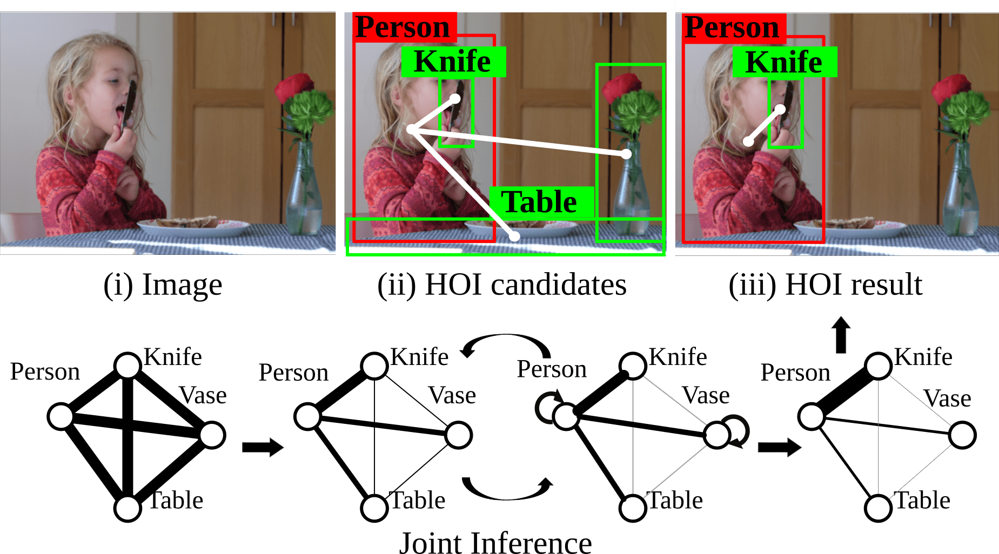

# ECCV2018 - Learning Human-Object Interactions by Graph Parsing Neural Networks

## Introduction
The algorithm is described in the [ECCV 2018 paper: Learning Human-Object Interactions by Graph Parsing Neural Networks](http://web.cs.ucla.edu/~syqi/publications/eccv2018gpnn/eccv2018gpnn.pdf). In this work, we introduce the Graph Parsing Neural Network (GPNN), a framework that incorporates structural knowledge while being differentiable end-to-end.

***

## Environment and installation
This repository is developed under **CUDA8.0** and **pytorch3.1** in **python2.7**. Early versions of pytorch can be found [here](https://pytorch.org/previous-versions/). The required python packages can be installed by:
```bash
pip install http://download.pytorch.org/whl/cu80/torch-0.3.1-cp27-cp27mu-linux_x86_64.whl
pip install -r requirements.txt
```

## Download the pre-trained model and features
- Download the entire `tmp` folder from [this google drive](https://drive.google.com/open?id=1op_bTKN5xyAi13ZQtsekLIZb_6vASlSi) and put under the root folder of the repository.
- Unzip the `hico_data_background_49.zip` file under `gpnn/tmp/hico/processed`.
- The file structure should look like:
```
/gpnn
  /src
    /python
  /tmp
    /cad120
    /hico
      /processed
        /hico_data_background_49
    /checkpoints
    /results
```

## Running the code
- Change the `self.project_root` in `config.py` to your own path of the repository.
- Run the following files for experiments:  
`hico.py` human-object interaction detection for HICO-DET dataset.  
`cad120.py`: detection for the CAD120 dataset.  
`cad120_prediction.py`: prediction for the CAD120 dataset.

If you want to train the model from scratch, just change the default epoch number from 0 to 100, and rename the pre-trained models. Running the above files should start the training.

## Evaluation
The experiment results are provided in `tmp/results/`. The benchmarking tool for the DET-HICO datset can be found [here](http://www-personal.umich.edu/~ywchao/hico/).

***
## Citation
If you find this code useful, please cite our work with the following bibtex:
```
@inproceedings{qi2018learning,
    title={Learning Human-Object Interactions by Graph Parsing Neural Networks},
    author={Qi, Siyuan and Wang, Wenguan and Jia, Baoxiong and Shen, Jianbing and Zhu, Song-Chun},
    booktitle={European Conference on Computer Vision (ECCV)},
    year={2018}
}
```
